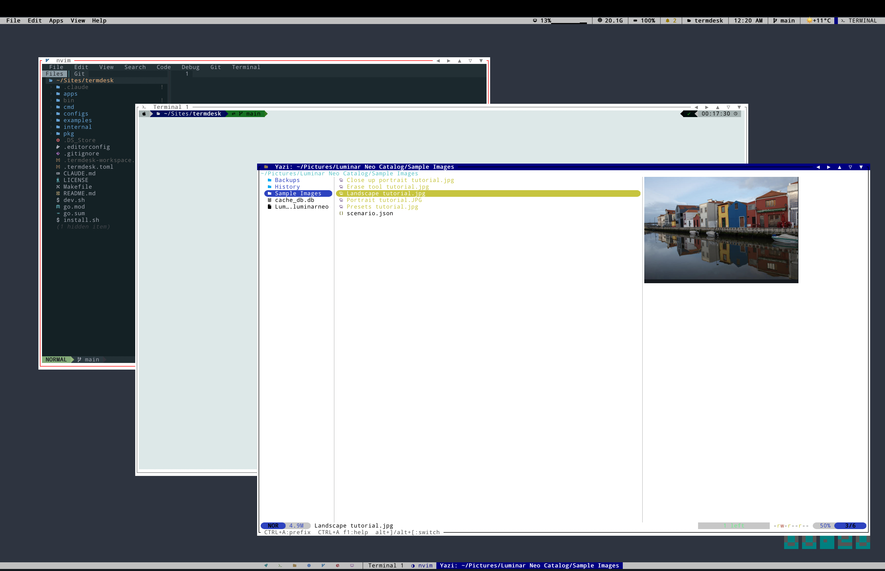
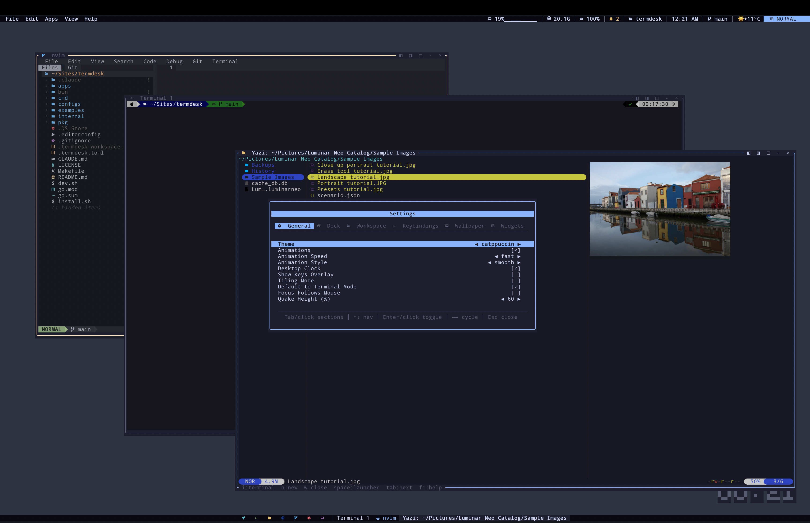

# Termdesk

A retro-flavoured desktop environment that runs inside a single terminal.
Overlapping windows, a menu bar, a dock, a command palette, themes, and real
shells running inside PTY windows. Built in Go on top of
[Bubble Tea v2](https://github.com/charmbracelet/bubbletea).

Inspired by Windows 1.0, DESQview and System 1 — but with modern niceties:
tmux-style sessions, sixel/kitty image passthrough, spring-physics animations
and a handful of built-in games.

> **Status: personal project.** I build this for myself, in my spare time.
> It's stable enough that I use it daily, but there is no support, no roadmap,
> and no promise of backward compatibility. Use at your own risk. Bug reports
> and patches are welcome but may sit for a while.

## Screenshots





## Quick start

```bash
git clone https://github.com/icex/termdesk.git
cd termdesk
./install.sh          # builds, installs, optionally pulls dependencies
termdesk
```

If you prefer to build manually:

```bash
go build -o bin/termdesk ./cmd/termdesk
./bin/termdesk
```

### Requirements

- Go 1.25+
- A terminal with truecolor and mouse support
- A Nerd Font (for dock icons)
- Recommended extras: `htop`, `yazi`, `nvim`, `python3`

### Platforms

| Platform | Status |
|---|---|
| Linux | first-class |
| macOS | works; `install.sh` handles dependencies |
| Android / Termux | works; build with `GOOS=android go build …` (not `go run`) |

## What's in the box

**Windowing**

- Overlapping windows with drag, resize, snap (left/right/top/bottom),
  maximize, tile, cascade and minimize
- Tmux-style split panes inside a window, draggable dividers
- Expose mode with animated thumbnails
- Spring-physics animations on open/close/snap/tile/minimize
- Persistent tiling mode (`columns`, `rows`, `tile all`) with live menu indicator

**Terminals**

- PTY windows running real shells and TUI apps
- VT100/ANSI emulation via `charmbracelet/x/vt`
- Keyboard and mouse forwarding — apps that enable mouse mode get events directly
- Vim-style copy mode with search, word/paragraph motions and stable snapshot scrolling
- Click-drag text selection (tmux-style)
- Image passthrough: sixel, iTerm2 inline images and the kitty graphics protocol
- Hold-open on exit — terminal stays open after the process exits; `r` restarts, `q` closes

**Sessions**

- tmux-like detach / reattach over a Unix socket
- Per-project named sessions (`termdesk ~/project`)
- Workspace auto-save every 60 seconds; layout and terminal buffers restored on attach

**UI**

- Menu bar with dropdowns and live widgets (CPU / memory / battery / clock / …)
- Custom shell-based widgets with `onClick` actions
- Dock with launcher shortcuts + a running-windows list
- Command palette (`Ctrl+Space`) with fuzzy search over apps and `$PATH`
- Right-click context menus, tooltips on hover
- Clipboard with a 5-slot ring buffer and history overlay
- Notifications (toasts + a notification center)
- Settings panel with 6 tabs, quake terminal (`Ctrl+` backtick), wallpapers (solid / pattern / live program), 14 themes
- Games: Minesweeper, Snake, Solitaire, Tetris

## Configuration

Config lives at `~/.config/termdesk/config.toml`:

```toml
theme = "modern"              # see View menu for the full list
animations = true
minimize_to_dock = true
tiling_mode = false
tiling_layout = "columns"     # columns | rows | all
quake_height_percent = 40

enabled_widgets = "cpu,mem,battery,notification,workspace,clock,user"

[keybindings]
prefix = "ctrl+a"             # like tmux

[[custom_widgets]]
name     = "git"
label    = "Git Branch"
icon     = "󰊢"
command  = "git rev-parse --abbrev-ref HEAD 2>/dev/null || echo '-'"
interval = 10
onClick  = "lazygit"
```

Per-project behaviour goes in a `.termdesk.toml` at the project root:

```toml
[[autostart]]
command = "npm"
args    = ["run", "dev"]
title   = "Dev Server"

[[autostart]]
command = "nvim"
args    = ["."]
title   = "Editor"

[[dock]]
name       = "Notepad"
icon       = "󱞁"
icon_color = "#E5C07B"
command    = "nano"
position   = 2
```

`termdesk ~/myproject` opens the directory, creates a named session, runs
auto-start commands and applies the project's dock items.

## Sessions

```bash
termdesk                  # start or attach the default session
termdesk ~/project        # open a project directory (named session)
termdesk new work         # create a named session
termdesk ls               # list sessions
termdesk attach work      # reattach
termdesk kill work        # kill
```

Press `F12` (or **File → Detach**) to detach. The session keeps running.

## Keybindings

### Normal mode (window management)

| Key | Action |
|---|---|
| `q` | Quit |
| `i` / `Enter` | Enter Terminal mode |
| `n` / `Ctrl+N` | New terminal window |
| `w` / `Ctrl+W` | Close focused window |
| `m` | Minimize |
| `r` | Rename (or restart an exited window) |
| `c` | Enter Copy mode |
| `Space` / `Ctrl+Space` | Launcher |
| `Tab` / `Shift+Tab` | Cycle windows → dock → menu bar |
| `h` / `l` | Snap left / right |
| `k` / `j` | Maximize / restore |
| `Alt+←/→` | Shrink / grow width |
| `Alt+↑/↓` | Shrink / grow height |
| `t` | Tile all |
| `F6` | Toggle auto-tiling (columns / rows / all) |
| `Alt+H/J/K/L` | Swap focused window left/down/up/right |
| `x` | Expose |
| `f` / `a` / `v` | File / Apps / View menu |
| `y` | Clipboard history |
| `b` | Notification center |
| `1`–`9` | Focus window N |
| `Ctrl+S` | Save workspace |
| `Ctrl+O` | Load workspace |
| `F1` | Help |

### Terminal mode (prefix system)

In Terminal mode, every key goes to the running program. The **prefix key**
(`Ctrl+A` by default) gates window-manager actions, like tmux.

| Key | Action |
|---|---|
| `Ctrl+A` | Activate prefix (status badge lights up) |
| `Ctrl+A` then *anything above* | Run a Normal-mode action |
| `Ctrl+A` `Esc` | Drop to Normal mode |
| `Ctrl+A` `Ctrl+A` | Send a literal `Ctrl+A` |
| `Ctrl+A` `c` | Copy mode |
| `Ctrl+A` `d` | Detach session |
| `Ctrl+A` `%` / `"` | Split pane horizontal / vertical |
| `Ctrl+A` `x` | Close focused pane |
| `Ctrl+A` arrows / `Tab` | Navigate panes |
| `` Ctrl+` `` | Toggle quake terminal |
| `F2` | Escape hatch back to Normal mode |

### Copy mode (vim-style)

| Key | Action |
|---|---|
| `j` / `k`, `PgUp` / `PgDn` | Scroll |
| `g` / `G` | Top / bottom |
| `w` / `b` / `e` | Word motions |
| `^` / `$` | Line start (indent) / end |
| `{` / `}` | Paragraph |
| `%` | Matching bracket |
| `/` / `?` | Search forward / backward |
| `n` / `N` | Next / previous match |
| `v` | Toggle selection |
| `y` / `Enter` | Yank |
| `Y` / `A` | Copy line / append to clipboard |
| `Esc` / `q` | Exit |

## Mouse

- Click a title bar to focus; drag it to move
- Drag borders/corners to resize
- Click title-bar buttons (close / maximize / minimize)
- Click a dock shortcut to launch (or focus an existing window)
- Click an empty-handed area of the dock to pick up the window list
- Click `CPU` / `MEM` widgets to open `htop`, click the clock for a date popup
- Click-drag inside a terminal to start a selection (enters copy mode)
- Scroll wheel enters copy mode on scrollback; scrolling back to the bottom exits

## Layout

```
cmd/termdesk/       entry point + session bootstrap
internal/
  app/              root model, rendering, animations
  config/           TOML config, themes, keybindings
  workspace/        workspace save/restore
  window/           windows, manager, hit testing, tiling, splits
  terminal/         PTY, VT emulation, image passthrough
  menubar/ dock/ launcher/ clipboard/ notification/
  session/          dtach-style client/server
  settings/ widget/ appmanifest/ contextmenu/ tour/ help/
pkg/
  geometry/ ringbuf/
apps/
  calc/ minesweeper/ snake/ solitaire/ tetris/
```

See [`CLAUDE.md`](CLAUDE.md) for development notes and gotchas.

## License

[MIT](LICENSE) — see the file for the full text.
